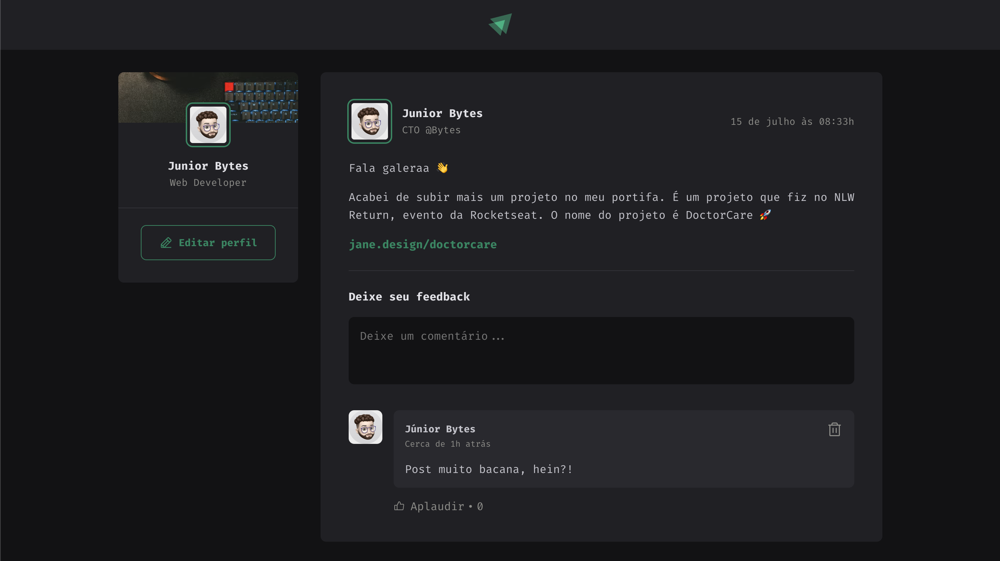
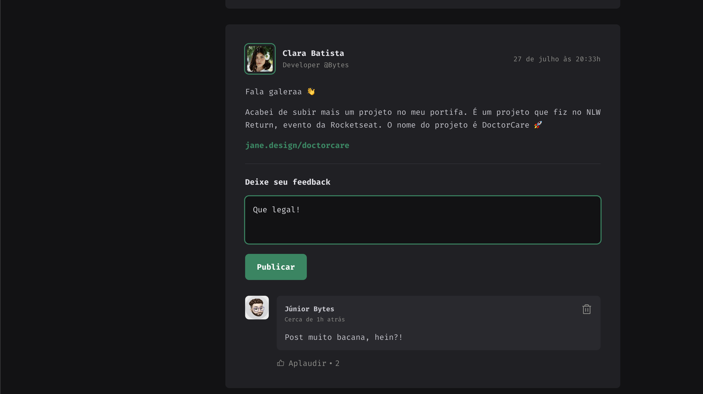

# Trilha React 2022 - Projeto 01 - Fundamentos do ReactJS

Nesse módulo foi criado um App React em TypeScript utilizando o Vite. Substitui meus projetos pessoais também que utilizavam o CRA após a defasagem e o DependaBot do GitHub emitir alguns alertas. Também não pude deixar de notar que o vite tem uma estrutura limpa e rápida para executar o App.

Conteúdos básicos foram abordados: componentização onde a gente separa partes reutilizáveis do app, propriedades onde podemos gerenciar comportamentos e compartilhar os dados para os componentes, imutabilidade capaz de manter os dados congruentes conforme o jeito do react renderizar as coisas na tela e alguns hooks do react.

